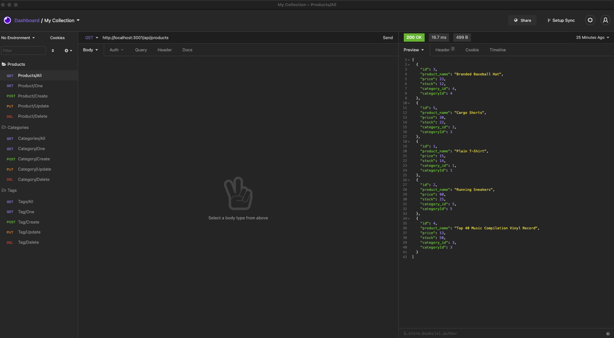

# Ecommerce_Backend

 
 

## **Description**
* Using Express and Insomnia to connect to an ecommerce database. I am able to view, create, update and delete data from the tables.
 
 

## **Table of Contents**
- [Installation](#Installation)  
- [Usage](#Usage)  
- [License](#License)  
- [Contributing](#Contributing)  
- [Tests](#Tests)  
- [Questions](#Questions)  
 
 

## **Installation**
* Clone from GitHub
 
 

## **Usage**
* To be able to view, create, update and delete data from a database using an ORM
 
 

## **License**
### *MIT*  
        A short and simple permissive license with conditions only requiring preservation of copyright and license notices. Licensed works, modifications, and larger works may be distributed under different terms and without source code.
 

## **Contributing**
* No contributions at this time
 
 

## **Tests**
    
* npm start 
 
 

## **Questions**
* GitHub: https://github.com/KevinHenleyCode

* For more questions you can reach me at my Email:(kevinhenleyinfo@gmail.com)
 
 

## **Screenshot**
    

 
 

## **Links**
    
[Video](https://www.youtube.com/watch?v=3Fyd8C7vyHI&ab_channel=KevinHenley)
 
 